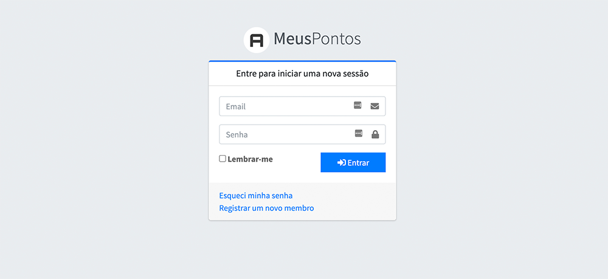

[ 💻 Projeto](#-projeto) |
[ 🗂 Banco de Dados](#-banco-de-dados) |
[ 🚀 Tecnologias](#-tecnologias) |
[ 🛠 Ferramentas](#-ferramentas) |
[ ⚙ Instalação](#-instalao) |
[ 📝 Como usar](#-como-usar) 

## 💻 Projeto

Sistema de bonificação para funcionários, para não bonificar os funcionários em forma de dinheiro, foi desenvolver um sistema onde os funcionários terão um saldo de pontos e esses pontos podem ser convertidos em recarga para celular, compra de produtos, etc.

## 🗂 Banco de Dados

Você usar o dump [meuspontos.sql](meuspontos.sql) ou Laravel Migrations [Database: Migrations](https://laravel.com/docs/7.x/migrations).

## 🚀 Tecnologias
Para esse projeto foi usado as seguintes tecnologias:

- [Laravel 7.16.1](https://laravel.com/docs/7.x)
- [Mysql](https://www.mysql.com/)
- [UIID](https://pt.wikipedia.org/wiki/Identificador_%C3%BAnico_universal#:~:text=Um%20identificador%20%C3%BAnico%20universal%20(do,%2D%20GUID)%20tamb%C3%A9m%20%C3%A9%20utilizado.)
- [Docker](https://www.docker.com/)
- [Laravel-AdminLTE](https://github.com/jeroennoten/Laravel-AdminLTE)

## 🛠 Ferramentas
- [PhpStorm](https://www.jetbrains.com/pt-br/phpstorm/)
- [Sequel Pro](http://sequelpro.com/)

## ⚙️ Instalação

##### Clone o repositório
```bash
  $ git clone https://github.com/glauberborges/MeusPontos.git
```

#### Instale as dependências
```bash
  $ cd MeusPontos
  
  $ composer install
```

#### Configurando o .env
```bash
  Renomeie/Copia o .env.example para .env e configure o banco de dados
  
  DB_CONNECTION=mysql
  DB_HOST=127.0.0.1
  DB_PORT=3306
  DB_DATABASE={DATABASE}
  DB_USERNAME={USER}
  DB_PASSWORD={SENHA}
```

Se for usar o servidor [Laradock](#servidor-opcional) use o nome do container Docker ou o IP do container em ``DB_HOST``

Para saber o nome do container do servidor do banco use `docker ps` será algo como `laradock_meuspontos_mysql_1`


Para saber o IP  use `docker inspect -f '{{.Name}} - {{range .NetworkSettings.Networks}}{{.IPAddress}}{{end}}' $(docker ps -aq)` será algo como `172.23.0.2`

#### Gerar a key
```bash
  $ php artisan key:generate 
```

#### Migration (Opcional)

Se você usou o [DUMP](#-banco-de-dados) do banco esse paço não precisa ser feito

```bash
  $ php artisan migrate
```
> Lembrando se tiver usando Docker esse comando deve ser feito dentro do container via SSH

#### Seed (Opcional)

Quer ter dados fake para fazer o teste? use o [Database: Seeding](https://laravel.com/docs/7.x/seeding#introduction)

```bash
  $ php artisan db:seed
```
> Lembrando se tiver usando Docker esse comando deve ser feito dentro do container via SSH

#### Servidor (Opcional)
> Se usa um servidor de sua preferência pule essa etapa
Você pode usar seu servidor preferido ou então usar o [Laradock](https://laradock.io/)

##### Laradock (Opcional)
Para usar o Laradock você precisa ter o Docker em sua máquina [Docker](https://www.docker.com/)

entre na pasta do Laradock
```bash
  $ cd laradock
```
```bash
  Renomeie/Copia o .env.example para .env e configure o banco de dados e o Apache do laradock 
  
  DB_DATABASE={DATABASE}
  DB_USERNAME={USER}
  DB_PASSWORD={SENHA}
  
```
```bash
  $ docker-compose up -d apache2 mysql
```

## 📝 Como usar

Faça um cadastro na rota ``{URL}/register`` e use e abuse! =D


> Achou algum erro? Envie um pull request =D 

> Fique à vontade para baixar e contribuir =D

---
